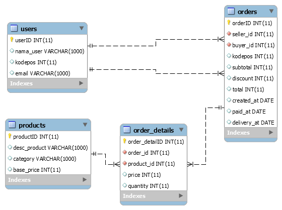

# Data Analysis for E-Commerce

This project involves analyzing e-commerce data using SQL to derive insights from various tables. The database consists of multiple interconnected tables that store information about users, orders, products, and order details.


## ER Diagram


Relationships:
- Users(ID) <-> Orders(Seller_ID, Buyer_ID)
- Orders(ID) <-> Order_Details(Order_ID)
- Products(ID) <-> Order_Details(Product_ID)
```

## Tables

### Users

The `Users` table stores information about users in the system.

| Column | Type    | Description            |
|--------|---------|------------------------|
| ID     | INT     | Unique identifier      |
| Name   | VARCHAR | Name of the user       |
| Email  | VARCHAR | Email address of user  |

### Orders

The `Orders` table stores information about orders placed by users.

| Column      | Type    | Description                           |
|-------------|---------|---------------------------------------|
| ID          | INT     | Unique identifier                     |
| Seller_ID   | INT     | ID of the seller (references Users(ID))|
| Buyer_ID    | INT     | ID of the buyer (references Users(ID)) |
| Subtotal    | DECIMAL | Subtotal amount of the order          |
| Discount    | DECIMAL | Discount applied to the order         |
| Total       | DECIMAL | Total amount of the order             |
| Created_At  | DATETIME| Order creation timestamp              |
| Paid_At     | DATETIME| Order payment timestamp               |
| Delivery_At | DATETIME| Order delivery timestamp              |

### Products

The `Products` table stores information about products available in the system.

| Column       | Type    | Description                   |
|--------------|---------|-------------------------------|
| ID           | INT     | Unique identifier             |
| Product_Desc | VARCHAR | Description of the product    |
| Category     | VARCHAR | Category of the product       |
| Base_Price   | DECIMAL | Base price of the product     |

### Order_Details

The `Order_Details` table stores detailed information about products in each order.

| Column     | Type    | Description                               |
|------------|---------|-------------------------------------------|
| ID         | INT     | Unique identifier                         |
| Order_ID   | INT     | ID of the order (references Orders(ID))   |
| Product_ID | INT     | ID of the product (references Products(ID))|
| Price      | DECIMAL | Price of the product in the order         |
| Quantity   | INT     | Quantity of the product in the order      |

## Analysis Performed

1. Who are the 5 users with the highest purchase value?
2. Users with the highest number of transactions but never use discounts
3. Particular Email domain of seller
4. Transaction value per month
5. Big Deals in December 2019
6. Best Selling Product Category in 2019 and 2020
7. Looking for Dropshipper
8. Looking for Reseller Offline
9. user who are both buyer and seller


## Conclusion

This project provides insights into the e-commerce data by analyzing user behavior, product sales, and order trends. The analysis helps in making informed decisions to improve business strategies and operations.
